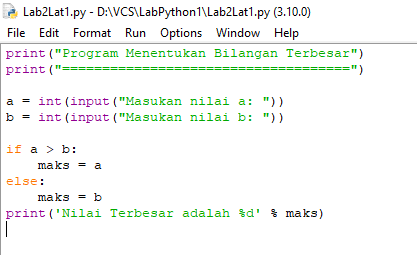
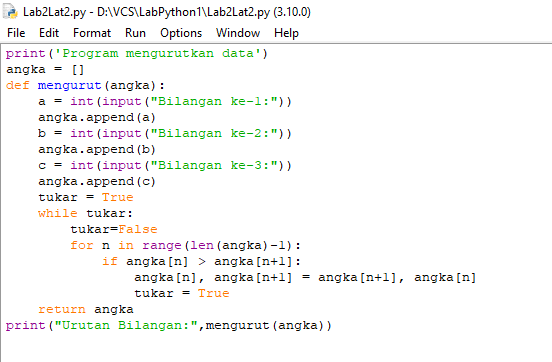

# LabPython1

## Lab 2: Struktur Kondisi
### Latihan 1
#### Program dan Output
- Program sederhana dengan input 2 buah bilangan serta menentukan bilangan terbesar dari kedua bilangan
    - Program Menentukan Bilangan Terbesar dari 2 Buah Bilangan

        ```bash
        print("Program Menentukan Bilangan Terbesar")
        print("====================================")

        a = int(input("Masukan nilai a: "))
        b = int(input("Masukan nilai b: "))

        if a > b:
            print ("A yang terbesar")
        elif b > a:
            print ("B yang terbesar")
        ```
        

    - Output

        

### Latihan 2
#### Program dan Output
- Program mengurutkan data berdasarkan input jumlah data serta menentukan urutan dari data terkecil
    - Program mengurutkan data berdasarkan input jumlah data serta menentukan urutan dari data terkecil

        ```bash
        print('Program mengurutkan data')
        print("========================")

        pertama = int(input("Bilangan pertama: "))
        kedua = int(input("Bilangan kedua: "))
        ketiga = int(input("Bilangan ketiga: "))

        print(f'urutan: {pertama} {kedua} {ketiga}')
        ```
        

    - Output

        

## Lab 3: Perulangan
### Latihan 1
#### Program dan Output
- Program Perulangan Bertingkat
    - Program Perulangan Bertingkat

        ```bash
        #Program Perulangan

        for i in range(0, 10):
          for j in range(10):
            print('%3d'%(i+j), end = ' ')
          print(' ')
        ```
        
 
    - Output

        