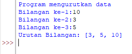

# LabPython1
# Lab 2: Struktur Kondisi
## Latihan 1
### Program dan Output
### Program sederhana dengan input 2 buah bilangan serta menentukan bilangan terbesar dari kedua bilangan
- Program Menentukan Bilangan Terbesar dari 2 Buah Bilangan

    ```bash
    print("Program Menentukan Bilangan Terbesar")
    print("====================================")

    a = int(input("Masukan nilai a: "))
    b = int(input("Masukan nilai b: "))

    if a > b:
        maks = a
    else:
        maks = b
    print('Nilai Terbesar adalah ',maks)
    ```
    

- Output

    


- Penjelasan:

1. Untuk menginput dua variabel dengan bilangan bulat (Integer) yang akan dimasukkan dan dimasukkan ke dalam variabel `hasil`

    ```bash
    a = int(input( " Masukan nilai a: " ))
    b = int(input( " Masukan nilai b: " ))
    ```

- Proses: 

2. Jika (if) bilangan pertama lebih besar dari bilangan kedua maka hasilnya adalah Bilangan pertama lebih besar

    ```bash
    if a > b:
    maks = a

3.  Tetapi jika bilangan kedua lebih besar dari bilangan pertama maka hasilnya adalah bilangan kedua lebih besar (else)

    ` ` 
    else:
    
        maks = b
      ` ` 

4. Untuk menampilkan hasil dari dua buah bilangan yang tersedia diatas

    ` ` ` bash
    print('Nilai Terbesar adalah ',maks)
    ` ` `

## Latihan 2
### Program dan Output
### Program mengurutkan data berdasarkan input jumlah data serta menentukan urutan dari data terkecil
- Program mengurutkan data berdasarkan input jumlah data serta menentukan urutan dari data terkecil

     ```bash
    print('Program mengurutkan data')

    a = int(input("Bilangan ke-1:"))
    b = int(input("Bilangan ke-2:"))
    c = int(input("Bilangan ke-3:"))
    data = [a,b,c]
    data.sort()

    print("Urutan Bilangan:", data)
    ```

    

- Output

    

- Penjelasan:

1. Untuk menginput lima buah bilangan yang akan dimasukan ke list variabel `data`

    ```bash
    a = int(input("Bilangan ke-1:"))
    b = int(input("Bilangan ke-2:"))
    c = int(input("Bilangan ke-3:"))
    data = [a,b,c]
    ```

2. Data akan diproses menggunakan metode sort. yaitu metode untuk mengurutkan data, baik itu dari nilai terkecil ataupun terbesar.

    ```bash
    data.sort()
    ```

3. Menampilkan urutan data dari nilai terkecil

    ```bash
    print("Urutan Bilangan: ", data)
    ```

# Lab 3: Perulangan
## Latihan 1
### Program dan Output
### Program Perulangan Bertingkat
- Program

    ```bash
    #Program Perulangan

    for i in range(0, 10):
        for j in range(10):
            print('%3d'%(i+j), end = ' ')
        print(' ')
    ```

    

- Output

    

- Penjelasan: i (baris) j (kolom)

1. Untuk melakukan perulangan baris dan kolom dengan nilai 10, menggunakan `nested for`

    ```bash
    for i in range(10):
        for j in range(10):
    ```

2. Untuk menampikan hasil dari perulangan
   * Agar terlihat lebih rapih, gunakan `format string` rata ke kanan sebanyak 3 karakter
   * Agar tidak membuat baris baru menggunakan `end=''` (i/baris)
   * Penggunaan `print()` untuk membuat baris baru (j/kolom)

    ```bash
        print("%3d"%(i+j), end='')
    print()
    ```

### Latihan 2
#### Program dan Output
- Tampilkan n bilangan acak yang lebih kecil dari 0.5
- Nilai n diisi pada saat runtime
- Anda bisa menggunakan kombinasi while dan for untuk menyelesaikannya

- Program 

    ```bash
    from random import random
    n = int(input("Masukan Nilai N: "))
    for i in range(n):
        while 1:
            n = random()
            if n < 0.5:
                break
        print(n)
    ```

    

- Output

     

- Penjelasan: 
1. Import module random untuk membuat bilangan acak

    ```bash
    from random import random
    ```

2. Untuk menginput nilai yang ingin dikonversikan kedalam bilangan bulat (Integer) yang akan di masukan kedalam variabel `n`

    ```bash
    n = int(input("Masukan Nilai N: "))
    ```

3. Untuk pengulangan range yang diinputkan oleh variable `n`

    ```bash
    for i in range(n):
        while True:
            n = random()
            if n < 0.5:
    ```

4. Menampilkan hasil dari `n`

    ```bash
        print(n)
    ```

# TERIMA KASIH